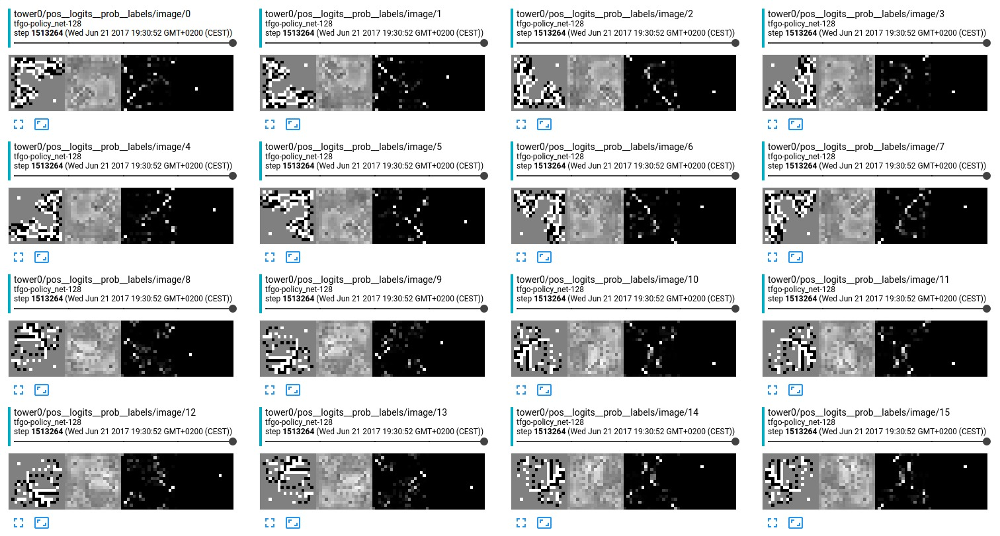

## Policy-Network (SL) from AlphaGO in TensorFlow

Yet another re-implementation of the policy-network (supervised) from Deepmind's AlphaGo. This uses a C++ backend to compute the feature planes presented in the [Nature-Paper](https://gogameguru.com/i/2016/03/deepmind-mastering-go.pdf) and a custom fileformat for efficient storage.

### Data + Features

See [here](https://u-go.net/gamerecords/) or [here](https://www.u-go.net/gamerecords-4d/) to get a database of GO games in the SGF fileformat. it is also possible to buy a database `GoGoD`. This database consists of `89942` (without the games before 1800). Some statistics about this database are

        - 2052 out of 89942 games are corrupt ~2.281470%
        - 2908 out of 89942 games are amateur ~3.233195%
        - total moves 17 676 038 (games with professional)
        - average moves 207 per game
        - u-go.net provides 1681414 files including some amateur games.

To handle these games efficiently, we convert them to binary by

        python reader.py --action convert --pattern "/tmp/godb/Database/*/*.sgf"

Now, to merge all games within a single file, we dump these games to an LMDB file (train/val/test split of the games):

        python go_db.py --lmdb "/tmp/godb/" --pattern "/tmp/godb/Database/*/*.sgfbin" --action create

I do not split the positions into train/val/test, I split the games to makes sure they are totally independent. All training data can be compressed to just (1.1GB/55M) and validation data is just (120MB/6.2MB) for u-go.net/GoGoD databases. 
To simulate the board position from the encoded moves, we setup the SWIG-Python binding `goplanes` of the C++ implementation by:

        cd go-engine && python setup.py install --user

Reading some feature-planes (currently I only implemented 47 of out 49) from random moves extracted from the db gives a speed of 108.03 examples/s in a single-threaded run which includes also all rotations. I verified this implementation along all final positions from GoGoD simulated in GnuGo and GoPlane.
Training uses an efficient multi-process pre-fetching (530 examples/s 12 core machine)

        python go_db.py --lmdb "/home/patwie/godb/go_train.lmdb" --action benchmark

### Training 

To train the version with `128` filters just fire up. 

        python tfgo.py --gpu 0,1 --k 128 --path /tmp # or --gpu 0 for single gpu

I saw no big different on a small number of GPUS, this uses the Sync-Training rather than any Async-Training. It will also create checkpoints for the best performing models from the validation phase.

Tensorboard should show something like

  

* first from left: board position
* second from left: logits for move prediction
* third from left: probability for move prediction
* last: ground-truth playes move by professional player

At time of writing, I get a validation accuracy of 51.9 % (Top1) and 83.7 % (Top5). Keep fingers crossed I did not mess up the validation part of the code.