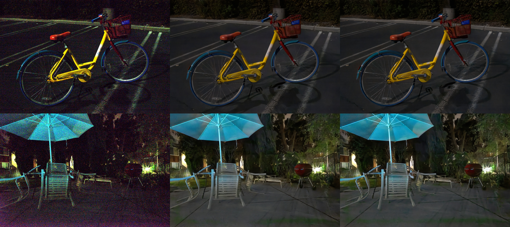

## Learning to See in the dark

Reproduces
[Learning to See in the Dark](https://arxiv.org/abs/1805.01934)
Chen et al.


Given an image capture with short exposure time, the network is trained to directly predict a long exposure time image.

<p align="center">  </p>

* Left: short exposure shot (amplified)
* Middle: official implementation
* Right: this implementation


### Usage

1. [Download their dataset](https://github.com/cchen156/Learning-to-See-in-the-Dark/blob/master/download_dataset.py)
2. Train the network

```bash
python learning_to_see_in_the_dark.py --gpu 0
```

3. Inference on an single image or set of images

```bash
python learning_to_see_in_the_dark.py --gpu 0 \
    --apply --load /scratch/wieschol/seeindark/train_log2/checkpoint \
    --short /scratch/wieschol/seeindark/dataset/Sony/short/00001_00_0.1s.ARW --exposure_time 10

python learning_to_see_in_the_dark.py --gpu 0 \
    --apply --load /scratch/wieschol/seeindark/train_log2/checkpoint \
    --short "/scratch/wieschol/seeindark/dataset/Sony/short/1*_00_*.ARW" --exposure_time 10
```

You might want to download the [pretrained model (not official)](http://files.patwie.com/recipes/models/seeinthedark.npz) for inference.

### Tensorboard

Tensorboard will show intermediate results from the training and test set.


### Issues

Current very bright regions in the input (light sources) introduce some artifacts.
