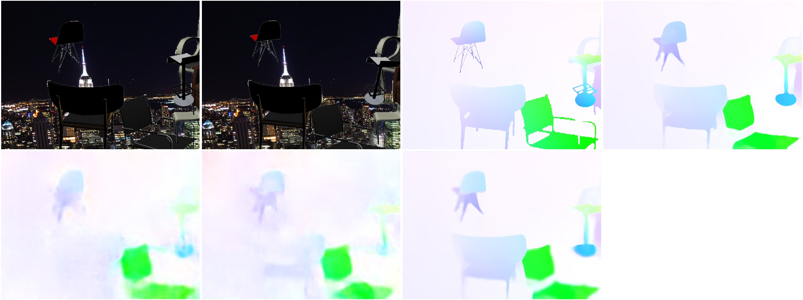

## OpticalFlow - FlowNet2

Reproduces
[FlowNet 2.0: Evolution of Optical Flow Estimation with Deep Networks](https://arxiv.org/abs/1612.01925)
by Ilg et al.

Given two images, the network is trained to predict the optical flow between these images.

<p align="center">  </p>

* Top: both input images from Flying Chairs.
* Bottom: FlowNet2-C, FlowNet2-S results


### Usage

1. Download the pre-trained model:

```bash
wget http://files.patwie.com/recipes/models/flownet2-s.npz
wget http://files.patwie.com/recipes/models/flownet2-c.npz

```

*Note:* Using these weights, requires to accept the author's license:

```
Pre-trained weights are provided for research purposes only and without any warranty.
Any commercial use of the pre-trained weights requires FlowNet2 authors consent.
```

2. Run inference

```bash
python python flownet2.py --gpu 0 \
        --left left_img.ppm \
        --right right_img.ppm \
        --load flownet2-s.npz --model "flownet2-s"
python python flownet2.py --gpu 0 \
        --left left_img.ppm \
        --right right_img.ppm \
        --load flownet2-c.npz --model "flownet2-c"
```

For `FlowNet2-C` you need to compile the operation in user_ops until this [PR](https://github.com/tensorflow/tensorflow/pull/21392) gets merged:

```bash
cd user_ops
cmake .
make
```