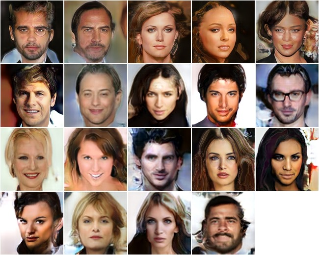

## PGAN - Progressive Growing of GANs for Improved Quality, Stability, and Variation

Reproduce
[Progressive Growing of GANs for Improved Quality, Stability, and Variations](https://arxiv.org/abs/1710.10196)
by Karras et al.

Given an 512-dimensional noise vector, the network is trained to
produce a high resolution image of a face, like these generated faces (128px x 128px)

<p align="center">  </p>


### Usage

1. create celebHQ by the code provided from the authors

```bash
python convert_to_lmdb.py --h5 <celeb.h5> --lmdb /path/to/celebHQ.lmdb
```

2. Train the model

```bash
# TRAIN 1
python pgan.py --gpu 2 --blocks 1 --action d
rm -rf /CHECKPOINTS/pgan/block1
mv /CHECKPOINTS/pgan/pgan /CHECKPOINTS/pgan/block1

# TRANSITION 1 -> 2
python pgan.py --gpu 2 --transition --blocks 2 --action d --load /CHECKPOINTS/pgan/block1/checkpoint
rm -rf /CHECKPOINTS/pgan/block1to2
mv /CHECKPOINTS/pgan/pgan /CHECKPOINTS/pgan/block1to2

# TRAIN 2
python pgan.py --gpu 2 --blocks 2 --action d --load /CHECKPOINTS/pgan/block1to2/checkpoint
rm -rf /CHECKPOINTS/pgan/block2
mv /CHECKPOINTS/pgan/pgan /CHECKPOINTS/pgan/block2

# ....

# TRAIN 6
python pgan.py --gpu 2,3 --blocks 6 --action d --load /CHECKPOINTS/pgan/block5to6/checkpoint
rm -rf /CHECKPOINTS/pgan/block6
mv /CHECKPOINTS/pgan/pgan /CHECKPOINTS/pgan/block6
```

This implementation has not gradient clipping and uses RMSprop. Multi-GPU is enabled, use it the increase the batch-size.